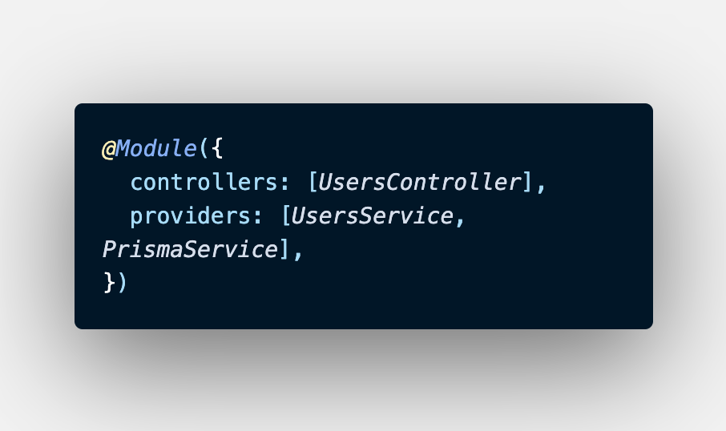

### Prisma Note


**Create prisma**
___

```
$ npx prisma
$ npx prisma init
```


**Create prisma migrate**
___
```
$ npx prisma migrate dev --name <init>

example
$ npx prisma migrate dev --name first-migrate
```

**Open prisma studio**
___
```
$ npx prisma studio
```

**Add prisma service into module provider before use**
___
